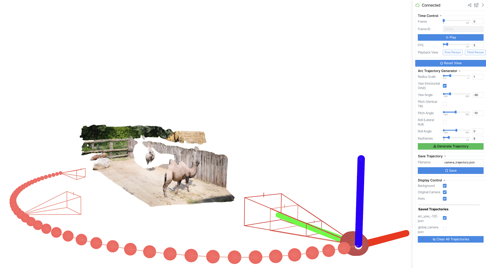
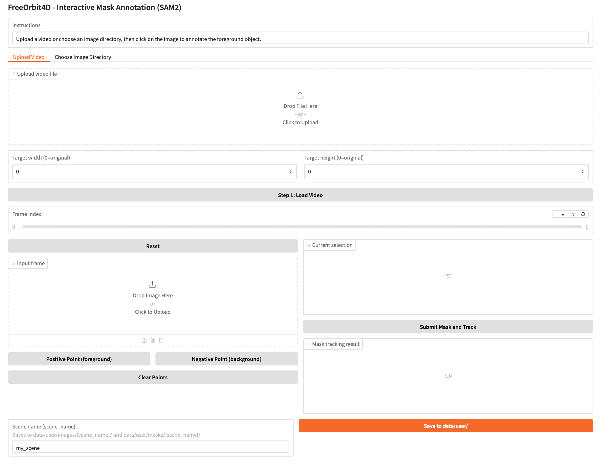

<p align="center">
  
</p>

### <p align="center">[FreeOrbit4D: Training-free Arbitrary Camera Redirection for Monocular Videos via Foreground-Complete 4D Reconstruction](https://arxiv.org/abs/2601.18993)</p>

<h4 align="center">ACM SIGGRAPH 2026 Conference Papers</h4>

<p align="center">
  <a href="https://cvmlgroup.web.illinois.edu/freeorbit4d/"></a>
  <a href="https://arxiv.org/abs/2601.18993"></a>
</p>

<p align="center">
  <a href="https://vveicao.github.io/">Wei Cao</a><sup>1</sup>,
  <a href="https://haoz19.github.io/">Hao Zhang</a><sup>1</sup>,
  <a href="https://tianfr.github.io/">Fengrui Tian</a><sup>2</sup>,
  <a href="https://yulunwu0108.github.io/">Yulun Wu</a><sup>1</sup>,
  <a href="https://www.yingying.li/">Yingying Li</a><sup>1</sup>,
  <a href="https://shenlong.web.illinois.edu/">Shenlong Wang</a><sup>1</sup>,
  <a href="https://ningyu1991.github.io/">Ning Yu</a><sup>3,4</sup>,
  <a href="https://yaoyaoliu.web.illinois.edu/">Yaoyao Liu</a><sup>1</sup>
</p>

<p align="center">
  <sup>1</sup>University of Illinois Urbana-Champaign, <sup>2</sup>University of Pennsylvania, <sup>3</sup>Eyeline Labs, <sup>4</sup>Netflix
</p>

<h4 align="center"><b>TL;DR: FreeOrbit4D is an effective training-free method for large-angle camera redirection via geometry-complete 4D proxy.</b></h4>

<div align="center">
<table>
<tr>
<td align="center"><b>Input Video</b></td>
<td align="center"><b>Interactive 4D</b><br><sub>(click to explore)</sub></td>
<td align="center"><b>Output Video</b></td>
</tr>
<tr>
<td align="center"></td>
<td align="center"><a href="https://vveicao.github.io/projects/freeorbit4d/build/?playbackPath=https://vveicao.github.io/projects/freeorbit4d/assets/camel/camel_4d_v14.viser&initDistanceScale=1&initHeightOffset=0.0"></a></td>
<td align="center"></td>
</tr>
<tr>
<td align="center"></td>
<td align="center"><a href="https://vveicao.github.io/projects/freeorbit4d/build/?playbackPath=https://vveicao.github.io/projects/freeorbit4d/assets/breakdance/breakdance_4d.viser&initDistanceScale=1&initHeightOffset=0.0"></a></td>
<td align="center"></td>
</tr>
<tr>
<td align="center"></td>
<td align="center"><a href="https://vveicao.github.io/projects/freeorbit4d/build/?playbackPath=https://vveicao.github.io/projects/freeorbit4d/assets/unitree/unitree_4d.viser&initDistanceScale=1&initHeightOffset=0.0"></a></td>
<td align="center"></td>
</tr>
</table>
</div>

### Multiple Trajectories from a Single Input

<div align="center">
<table>
<tr>
<td align="center"><b>Input Video</b></td>
<td align="center"><b>Trajectory #1</b></td>
<td align="center"><b>Trajectory #2</b></td>
</tr>
<tr>
<td align="center"></td>
<td align="center"></td>
<td align="center"></td>
</tr>
<tr>
<td align="center"></td>
<td align="center"></td>
<td align="center"></td>
</tr>
<tr>
<td align="center"></td>
<td align="center"></td>
<td align="center"></td>
</tr>
</table>
</div>

For more results, please visit our [project page](https://cvmlgroup.web.illinois.edu/freeorbit4d/).

## 🔥 News
- **May 10, 2026**: 🤗 We release the code of FreeOrbit4D!
- **March 30, 2026**: 🎉 FreeOrbit4D is accepted to SIGGRAPH 2026 Conference Papers!

## Installation

Validated on Linux with an NVIDIA GPU (≥ 46 GB VRAM recommended, ~130 GB disk for checkpoints and HF cache). The installer pins **CPython 3.10 + PyTorch 2.4.0 + xformers 0.0.27.post1 + CUDA 12.1 (cu121 wheels)** inside a conda environment, so the host NVIDIA driver must support CUDA 12.1.

### Setup

```bash
# Clone the repository and its submodules.
git clone --recursive https://github.com/VVeiCao/FreeOrbit4D.git
cd FreeOrbit4D

# Create the conda environment and install dependencies.
bash setup_env.sh
conda activate freeorbit4d

# Download the checkpoints required by the pipeline.
bash download_checkpoints.sh required
```

## Quick Start

Run an end-to-end pipeline on a bundled scene:

```bash
python run_pipeline.py full --config configs/scenes/camel.yaml # Other demos: breakdance, car-turn, horsejump-high.
```

The final video is saved to `outputs/rendering/{scene_name}/{trajectory_name}/inference/output_video.mp4`.

Visualize the reconstructed 4D point cloud:

```bash
python scripts/1_2_visualization.py --config configs/scenes/camel.yaml
```

For stage-by-stage commands and data structures, see [docs/pipeline.md](docs/pipeline.md).

## Custom Camera Trajectories

Author a new camera path for any reconstructed scene — bundled or your own. Replace `<config>` with the scene's yaml (e.g. `configs/scenes/camel.yaml` or `configs/user/{scene_name}.yaml`).

```bash
python scripts/1_3_cam_traj.py --config <config>
```

<p align="center">
  
</p>

1. Set the trajectory parameters you want in the editor.
2. Enter a filename such as `my_trajectory.json`.
3. Click `Generate Trajectory`, then click `Save`.

Re-render with the saved trajectory (skips reconstruction):

```bash
python run_pipeline.py full --config <config> --resume_from render --trajectory_json my_trajectory.json
```

The filename is resolved relative to the scene's prepared directory. For detailed editor controls, see [docs/trajectory_editor.md](docs/trajectory_editor.md).

## Run on Your Own Video

Take an `854x480` video with at least 45 usable frames, annotate the foreground subject, and run the full pipeline on it. The pipeline currently supports **a single, fully-visible foreground object** per scene — multiple subjects or heavy occlusion will fail downstream.

### Step 1 — Annotate the foreground

Download the SAM2 checkpoint (one-time), then launch the Gradio UI to draw a mask and save a scene config to `configs/user/{scene_name}.yaml`.

```bash
bash download_checkpoints.sh sam2
python scripts/prep_interactive_mask.py --port 8890
```

<p align="center">
  
</p>

### Step 2 — Run the pipeline

The default trajectory is a `yaw -120°` orbit. To customize it, edit the generated `configs/user/{scene_name}.yaml` before running.

```bash
python run_pipeline.py full --config configs/user/{scene_name}.yaml
```

The final video is saved to `outputs/user/rendering/{scene_name}/{trajectory_name}/inference/output_video.mp4`.

For input requirements, point-prompting tips, and output layout, see [docs/process_your_own_video.md](docs/process_your_own_video.md).

## Citation

```bibtex
@inproceedings{cao2026freeorbit4d,
  title={{FreeOrbit4D}: Training-free Arbitrary Camera Redirection for Monocular Videos via Foreground-Complete {4D} Reconstruction},
  author={Cao, Wei and Zhang, Hao and Tian, Fengrui and Wu, Yulun and Li, Yingying and Wang, Shenlong and Yu, Ning and Liu, Yaoyao},
  booktitle={ACM SIGGRAPH Conference Papers},
  year={2026}
}
```

## Acknowledgements

FreeOrbit4D builds on several excellent open-source projects and pretrained models. We thank the authors of [SV4D](https://huggingface.co/stabilityai/sv4d2.0) and [Stability AI generative-models](https://github.com/Stability-AI/generative-models), [VGGT](https://github.com/facebookresearch/vggt), [PAGE-4D](https://page4d.github.io/), [DiffSynth-Studio](https://github.com/modelscope/DiffSynth-Studio), [Wan2.2-VACE-Fun-A14B](https://huggingface.co/alibaba-pai/Wan2.2-VACE-Fun-A14B), [Qwen3-VL](https://huggingface.co/Qwen/Qwen3-VL-2B-Instruct), [PyTorch3D](https://github.com/facebookresearch/pytorch3d), and [SAM2](https://github.com/facebookresearch/sam2).
